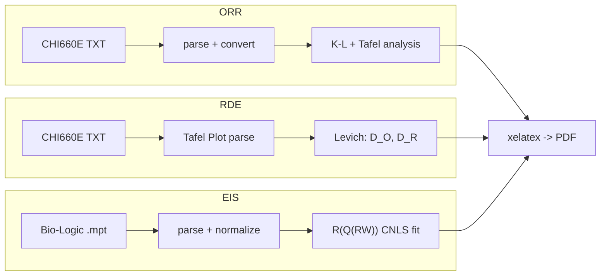

# CHI660E 电化学数据分析项目集

[](https://github.com/22xuan/CHI660E-Projects/actions)
[]()
[]()

基于 CHI660E 和 Bio-Logic 电化学工作站的 Python 自动化数据分析流水线。



## 项目

### [ORR-RDE 氧还原分析](orr/)

催化剂的氧还原反应（ORR）性能分析：
- Koutecky-Levich 电子转移数、Tafel 动力学、iR 补偿
- Co$_3$O$_4$/C vs 20% Pt/C，304/316 不锈钢电极
- [报告 (Markdown)](orr/report/ORR_RDE_分析报告.md) · 12 项测试

### [RDE 动力学参数测定](rde-kinetics/)

旋转圆盘电极测定 Fe(CN)$_6^{3-/4-}$ 氧化还原体系动力学参数：
- Levich 分析 → 扩散系数 + 基线扣除 + 误差传播
- K-L 分析 → 动力学电流、Tafel 外推 → 传递系数
- [报告 (Markdown)](rde-kinetics/report/RDE_分析报告.md) · 1 项测试

### [EIS 腐蚀阻抗分析](eis/)

低合金钢 CO₂ 腐蚀的等效电路分析（Bio-Logic SP-200 数据）：
- Nyquist + Bode 图，R(Q(RW)) CNLS 拟合，3 项单元测试
- 已发表数据（Corrosion Science, 2020），CC BY 4.0
- [LaTeX 报告](eis/report/CO2_EIS_报告.pdf) · 3 项测试

## 快速开始

```bash
cd orr/ && bash run_all.sh           # ORR 全流程
cd rde-kinetics/ && bash run_all.sh  # RDE 全流程
cd eis/ && bash run_all.sh             # EIS 全流程
```

## 技术栈

Python (NumPy, SciPy, Pandas, Matplotlib, PyYAML) + OriginPro + LaTeX

## 协议

MIT License
